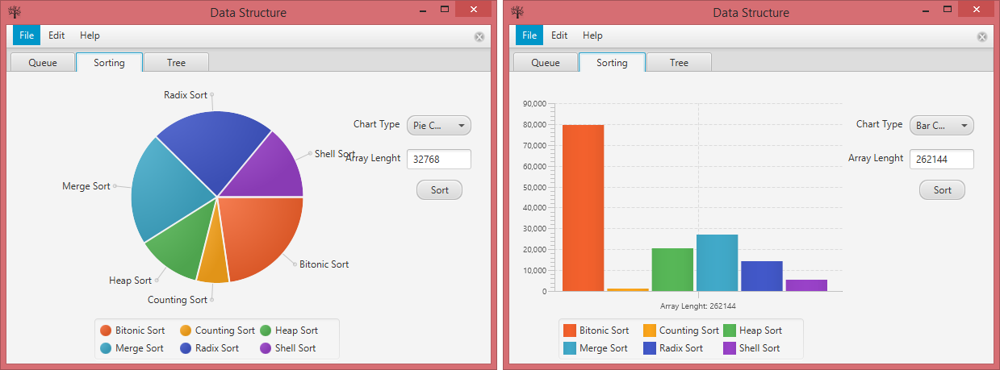
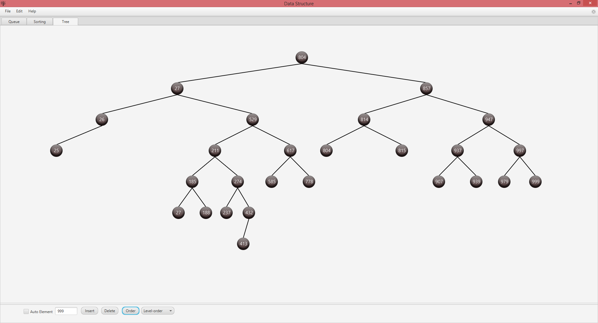

### Data Structure — Queue, Tree, Sorting Algorithm Speed Analysis

#### Sorting Algorithm Analysis
Program generates array of integers according to input then sort this array with Bitonic, Counting, Heap, Radix, Merge and Shell sort algorithms. At the end, shows analysis result on pie and bar charts.

#### Unbalanced Tree
Program generates array of integers then fill tree with those integer numbers.

