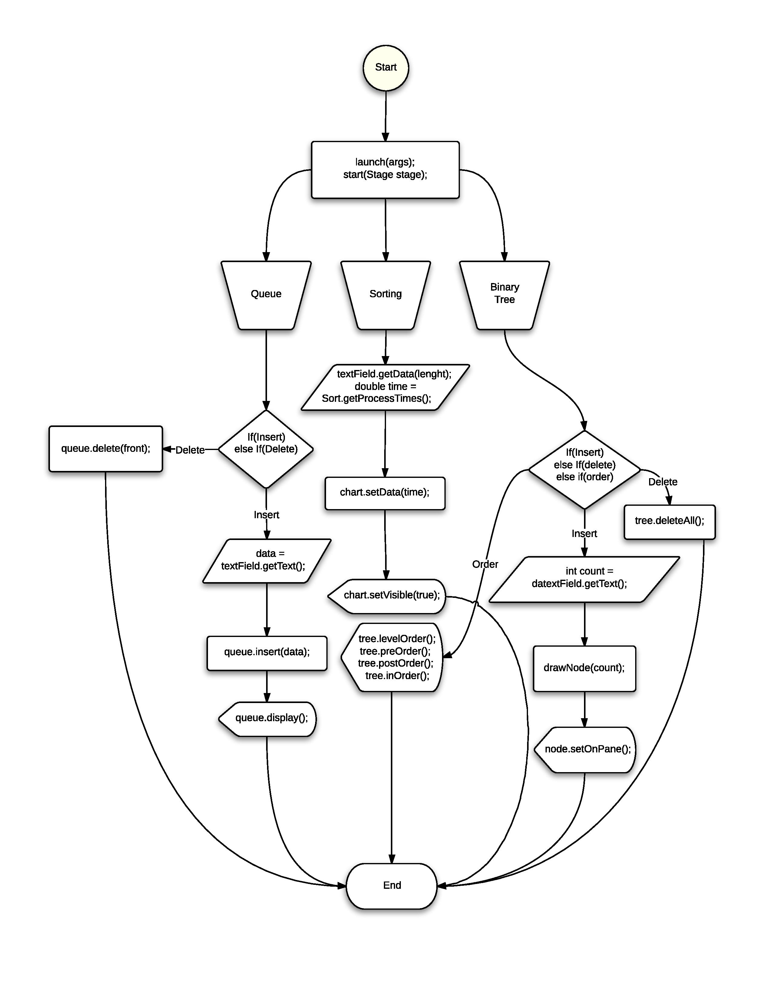

### Data Structure — Queue, Tree, Sorting Algorithm Speed Analysis
A university project created using JavaFX software platform. To have an idea about the project content read below.

#### Linked Queue
Simple linked queue structure in which all nodes have a process time.

#### Sorting Algorithm Analysis
Program generates array of integers according to input then sort this array with Bitonic, Counting, Heap, Radix, Merge and Shell sort algorithms. At the end, compares the sorting speeds and shows analysis result on pie and bar charts.

#### Binary Tree
Program generates array of integers then fills the tree with those integer numbers.

#### Flowchart

